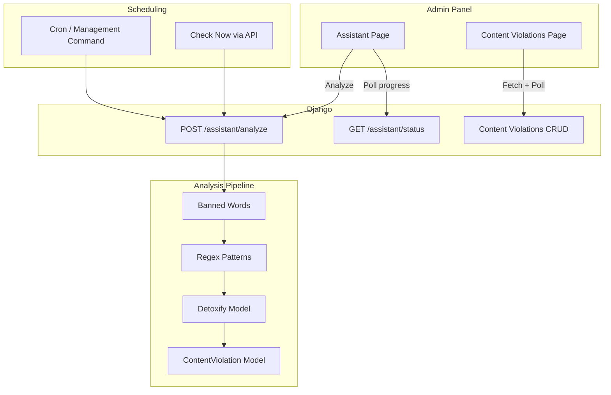

# AI Content Moderation Agent — план реализации

> Обновлено: Detoxify + Banned words + Regex (вместо OpenAI)

## Архитектура



---

## Детекция контента: Detoxify + Banned words + Regex

Трёхуровневый конвейер анализа:

| Уровень | Метод | Назначение |
|---------|-------|------------|
| **1** | **Banned words** | Точное совпадение со списком запрещённых слов |
| **2** | **Regex** | Обход символов (з@мен@), спам-паттерны, ссылки |
| **3** | **Detoxify** | Токсичность, оскорбления, нецензурное (семантика) |

**Порядок выполнения:**
1. Сначала быстрый проход по banned words — если совпадение → violation, дальше не проверяем этот фрагмент.
2. Regex — ловит обфусцированные слова, типичные спам-шаблоны.
3. Detoxify — всё, что прошло без флага, отправляется в модель (toxicity, obscenity, severe_toxicity и т.д.).

**Зависимости:**
```
detoxify
torch
transformers
```

**Учёт:**
- Detoxify — PyTorch-модель; первый запуск медленный (подгрузка весов).
- На CPU сотни постов/комментариев могут обрабатываться 1–3 минуты — учитывать в progress bar.

---

## 1. Рекомендация по планировщику

**Совет: начать с Cron + subprocess, при росте нагрузки рассмотреть Celery.**

| Подход | Плюсы | Минусы |
|--------|-------|--------|
| **Cron + management command** | Уже используется (backups), нет Redis/RabbitMQ | "Check now" требует отдельного механизма (subprocess + polling) |
| **Celery + Beat** | Универсально для задач и расписания | Нужен брокер (Redis), больше setup |

Для текущего scope достаточно:
- **Scheduled (hour/day):** cron запускает `python manage.py content_analyze --schedule hourly|daily`
- **Check now:** API `POST /admin/assistant/analyze` запускает анализ в отдельном процессе, возвращает `analysis_id`, фронтенд опрашивает `/admin/assistant/status/<id>/` для прогресса и логов.

---

## 2. Модель `ContentViolation`

Файл: `admin_panel/models.py`

```python
class ContentViolation(models.Model):
    TYPE_POST = 'post'
    TYPE_COMMENT = 'comment'
    
    STATUS_PENDING = 'pending'
    STATUS_CHECKED = 'checked'
    STATUS_IGNORED = 'ignored'
    
    REASON_OBSCENITY = 'obscenity'
    REASON_SPAM = 'spam'
    REASON_HARASSMENT = 'harassment'
    REASON_ABUSE = 'abuse'
    REASON_OTHER = 'other'
    
    content_type = models.CharField(max_length=10)  # post | comment
    item = models.ForeignKey(Item, null=True, blank=True, on_delete=models.CASCADE)
    comment = models.ForeignKey(Comment, null=True, blank=True, on_delete=models.CASCADE)
    status = models.CharField(max_length=20, default=STATUS_PENDING)
    reason = models.CharField(max_length=30)
    detected_word = models.CharField(max_length=255)  # найденное слово / фрагмент
    created_at = models.DateTimeField(auto_now_add=True)
    analysis_run = models.ForeignKey('AnalysisRun', null=True, on_delete=models.SET_NULL)
    
    class Meta:
        constraints = [
            UniqueConstraint(fields=['item'], condition=Q(item__isnull=False), name='uq_violation_item'),
            UniqueConstraint(fields=['comment'], condition=Q(comment__isnull=False), name='uq_violation_comment'),
        ]
```

Один пост / один комментарий — одна запись в Content Violations (через UniqueConstraint).

---

## 3. Модель `AnalysisRun` (логи и прогресс)

```python
class AnalysisRun(models.Model):
    schedule = models.CharField(max_length=20)  # 'now' | 'hourly' | 'daily'
    status = models.CharField(max_length=20)  # 'running' | 'completed' | 'failed'
    progress = models.PositiveSmallIntegerField(default=0)  # 0-100
    log_lines = models.JSONField(default=list)  # ["Start!", "Checked 50 items", ...]
    started_at = models.DateTimeField(auto_now_add=True)
    finished_at = models.DateTimeField(null=True, blank=True)
```

---

## 4. Конфигурация Banned Words и Regex

**ForbiddenWord** (модель или JSON в settings):
- `word` — запрещённое слово
- `reason` — obscenity, spam, abuse, etc.
- Опционально: `pattern` (regex) для обфускации

**Regex-паттерны:**
- Общие: замена букв цифрами/символами (а→@, о→0).
- Спам: URL, повторяющиеся символы, типичные фразы.
- Хранить в `ForbiddenPattern` (pattern, reason) или в конфиге.

---

## 5. Интеграция Detoxify

```python
# admin_panel/services/content_analyzer.py
import detoxify

def get_detoxify_model():
    """Lazy load — первый вызов ~10–30 сек на CPU."""
    return detoxify.load_toxic_comment_model()  # или multilingual

def analyze_text_detoxify(text: str) -> dict:
    model = get_detoxify_model()
    results = model.predict(text)
    # results: {'toxicity': 0.9, 'severe_toxicity': 0.1, 'obscene': 0.8, ...}
    return results
```

Порог (например 0.7) для toxicity/obscenity → создаём ContentViolation с `reason` и `detected_word` (фрагмент или "AI: toxicity").

---

## 6. Страница Content Violations

Расположение: Moderation → Content Violations

**Колонки таблицы:**
| Checkboxes | Type | Status | Date | Actions | Reasons | Word | Preview | Author | Actions |
|------------|------|--------|------|---------|---------|------|---------|--------|---------|
| ☐ | post/comment | Pending/Checked/Ignored | date | dropdown | reason | detected_word | link | author | Checked, Ignore, Delete |

**Поведение:**
- **Post в драфте или удалён** → strikethrough в Preview
- **Author удалён/забанен** → strikethrough, disabled для Actions
- **Checked** → badge зелёный, Actions: только Delete
- **Ignore** → badge жёлтый
- **Delete** → confirmation modal → удаление поста/комментария (и записи)
- **Clear** (при выбранных checkbox) → удаление только записей ContentViolation, без удаления контента

**Тулбар:**
- Поиск, фильтр Type, фильтр Status, Filter
- При выбранных checkboxes — кнопка Clear

**Пустое состояние:** "No content violations"

---

## 7. Страница Assistant

**UI:**
- Radio: Check now | Every hour | Every day
- Кнопка **Analyze** → `POST /admin/assistant/analyze` с `schedule`
- Progress bar (0–100%), при 100% — "Completed" (зелёный)
- Модальное окно (~400–450px) со скроллом — логи анализа

**Check now:** запуск сразу, прогресс и логи по polling  
**Every hour/day:** сохранение расписания + cron

---

## 8. Мгновенное заполнение таблицы

- Анализ пишет в `ContentViolation` по мере обнаружения нарушений.
- Фронт на Content Violations при `?analysis_id=X` опрашивает каждые 2–3 сек.
- Альтернатива: на Assistant после 100% — ссылка «View results» → Content Violations с фильтром по `analysis_id`.

---

## 9. API Endpoints

| Метод | URL | Назначение |
|-------|-----|------------|
| GET | `/admin/assistant/` | Страница Assistant |
| POST | `/admin/assistant/analyze/` | Запуск анализа, возврат `analysis_id` |
| GET | `/admin/assistant/status/<id>/` | JSON: progress, log_lines, status |
| GET | `/admin/content-violations/` | Список нарушений (пагинация, фильтры) |
| POST | `/admin/content-violations/<id>/check/` | Mark Checked |
| POST | `/admin/content-violations/<id>/ignore/` | Mark Ignored |
| POST | `/admin/content-violations/<id>/clear/` | Clear (удалить запись, не контент) |
| POST | `/admin/content-violations/<id>/delete-content/` | Удалить пост/комментарий |

---

## 10. Management command для cron

```bash
# Ежечасно
0 * * * * cd /path && python manage.py content_analyze --schedule hourly

# Ежедневно
0 2 * * * cd /path && python manage.py content_analyze --schedule daily
```

---

## 11. Файлы и изменения

| Действие | Файл |
|----------|------|
| Модели | `admin_panel/models.py` — ContentViolation, AnalysisRun, ForbiddenWord, ForbiddenPattern |
| Миграции | `admin_panel/migrations/` |
| Views | `admin_panel/views/assistant_views.py`, `moderation_views.py` |
| URL | `admin_panel/urls.py` |
| Templates | `admin/assistant/`, `admin/moderation/content_violations.html` |
| Services | `admin_panel/services/content_analyzer.py` — Banned words, Regex, Detoxify |
| Management command | `admin_panel/management/commands/content_analyze.py` |
| Sidebar | `admin_panel/templates/admin/layout/sidebar.html` |
| Dependencies | `requirements.txt` — detoxify, torch, transformers |

---

## Порядок реализации

1. Модели (ContentViolation, AnalysisRun, ForbiddenWord, ForbiddenPattern) и миграции
2. Сервис анализа: Banned words → Regex → Detoxify, фильтрация по `created_at`
3. Management command `content_analyze`
4. API: analyze, status, CRUD для ContentViolation
5. Шаблоны: Assistant, Content Violations
6. Интеграция в sidebar и роутинг
